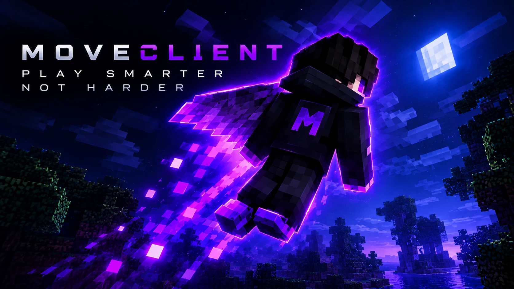

# Movement Test Client (Fabric, Minecraft 26.2)

Client-side Fabric mod for testing movement mechanics in a private/controlled world:
**Bhop**, **Flight**, **Anti-Knockback**, and **NoFall**, all driven by a shared
`ModuleManager`, a ClickGUI, per-module keybinds, and a JSON config file. No server-side
code, no network packet manipulation — everything runs against public client/vanilla APIs.

## Status

Builds and compiles cleanly against the real Minecraft 26.2 client jar (Mojang mappings,
unobfuscated) and Fabric API 0.161.0+26.2, verified with `./gradlew build` in this
environment using a Temurin JDK 25. The 26.2 client ships a significantly reworked
rendering API (`GuiGraphics` → `GuiGraphicsExtractor`, `Screen.render` →
`Screen.extractRenderState`, `Minecraft` no longer owns the current `Screen` directly —
`Minecraft.gui.screen()`/`setScreen(...)` does now, Fabric's old `HudRenderCallback` was
replaced by the layered `HudElementRegistry` API) and an input-event rewrite
(`AbstractWidget.onRelease` now takes a `MouseButtonEvent`). This project's GUI/HUD/input
code was written against and compiled against that real API, not guessed.

## Modules

| Module | Category | What it does | Key settings |
|---|---|---|---|
| **Bhop** | Movement | Auto-hop (removes jump-timing) + Quake/CS-style air-strafe acceleration. Ported from the sibling `bhop-mod` project. | Air Accel, Max Air Speed, Jump Velocity, Auto Hop |
| **Flight** | Movement | Toggleable 3D flight: WASD moves relative to look direction, jump/sneak are separate ascend/descend controls, gravity is disabled while active and restored on disable. | Horizontal Speed, Vertical Speed, Hover When Idle |
| **Speed** | Movement | Ground movement speed multiplier, applied as a reversible `Attributes.MOVEMENT_SPEED` modifier (stacks correctly with potions/enchants, fully undone on disable). | Multiplier |
| **Step** | Movement | Raises step height via a reversible `Attributes.STEP_HEIGHT` modifier so you can walk up full blocks without jumping. | Extra Height |
| **HighJump** | Movement | Jump height multiplier via a reversible `Attributes.JUMP_STRENGTH` modifier (the same attribute vanilla Jump Boost uses). | Multiplier |
| **Gravity** | Movement | Scales fall acceleration via a reversible `Attributes.GRAVITY` modifier — below 1.0 is floaty, above 1.0 is heavy. Independent of Flight's no-gravity behavior. | Multiplier |
| **AutoSprint** | Movement | Sprints automatically while moving forward, respecting hunger/sneak like vanilla sprint would. | — |
| **Spider** | Movement | Climb any wall you're pressed against by holding jump, like a ladder. | Climb Speed |
| **AirJump** | Movement | Extra mid-air jumps (double/triple/...), edge-detected independently of vanilla's jump handling. | Extra Jumps, Jump Velocity |
| **NoClip** | Movement | Disables world collision (`Entity.noPhysics`) for testing level geometry. | — |
| **ElytraBoost** | Movement | Forward thrust in your look direction while gliding on an elytra, capped to a max speed. | Thrust, Max Speed |
| **Teleport** | Movement | Teleports you to wherever you're looking, up to Max Range — a one-shot action key, not a persistent toggle. Client-side position set, only authoritative in singleplayer/LAN. | Max Range |
| **Sneak** | Movement | Forces continuous sneaking via the same `shiftKeyDown` flag vanilla sets while you hold the real key. | — |
| **Velocity** | Movement | Shows current horizontal/vertical movement speed in blocks/second, bottom-left. | — |
| **Keystrokes** | Movement | A classic WASD box grid, bottom-center, lit up per key's live state. | — |
| **Anti-Knockback** | Player | Cancels externally applied velocity on both axes. Horizontal uses a tight tolerance just above ordinary WASD acceleration; vertical predicts the expected value each tick (gravity while falling, the actual jump-strength attribute right as you leave the ground) and corrects anything that doesn't match, so real knockback/explosions get cancelled almost immediately while normal jumping and falling are unaffected. Known edge case: a slime block bounce looks like external knock-up from this model too, and gets cancelled the same way. | Horizontal Tolerance, Protect Vertical, Vertical Tolerance |
| **NoFall** | Player | Resets fall distance every tick while airborne past a configurable threshold. In singleplayer/LAN it also resets the authoritative fall distance on the integrated server's copy of your player, so it actually prevents damage there — but only once, exactly on the landing tick, instead of scheduling a redundant reset on every airborne tick of a long fall. | Min Fall Distance, Only Survival/Adventure, Singleplayer/LAN Only |
| **Jesus** | Player | Keeps you at the surface of water (optionally lava) instead of sinking; hold sneak to dive normally. | Affect Lava |
| **AutoTotem** | Player | Gets a Totem of Undying into your offhand when health drops low, searching your whole inventory (hotbar + main) for one and swapping it in directly via the same container-click action (`ContainerInput.SWAP`, button 40) vanilla's own inventory screen sends when you hover a slot and press F. | Health Threshold |
| **AutoArmor** | Player | Equips any armor piece sitting unequipped in your inventory into its matching empty armor slot, via `ContainerInput.QUICK_MOVE` — the same click type a real shift-click sends — so vanilla's own container logic routes it to the right slot. | — |
| **AutoRespawn** | Player | Respawns the instant you die, sending the same packet vanilla's death screen's Respawn button sends. | — |
| **Reach** | Player | Extends block and entity interaction range via reversible `ADD_VALUE` modifiers on the real `BLOCK_INTERACTION_RANGE`/`ENTITY_INTERACTION_RANGE` attributes. | Block Reach Bonus, Entity Reach Bonus |
| **MaceDamage** | Player | Bonus attack damage while holding a Mace, via a reversible `ADD_VALUE` modifier on `Attributes.ATTACK_DAMAGE`. Real dealt damage is server-side, so this also reaches into the integrated singleplayer/LAN server's authoritative copy (same technique as NoFall) — against a remote server it only affects the client-side prediction. | Bonus Damage |
| **ArrowDamage** | Player | Overrides every arrow you fire to a fixed damage value (can't add a bonus on top — `AbstractArrow` has no getter for vanilla's own computed damage, only a setter). Singleplayer/LAN only; has no effect against a remote server. | Damage |
| **ArmorHUD** | Player | Your four worn armor pieces as item icons with vanilla's own durability bar overlay, bottom-right. | — |
| **CPS** | Player | Attack/use clicks in the last real second, bottom-left. Read-only key polling, never interferes with normal attacking/using. | — |
| **Criticals** | Player | Times a tiny hop the instant you attack while grounded, so your own attacks land as critical hits (the manual "jump-reset crit" trick, automated). Only reacts to your own attack key; never targets or attacks anything by itself. | Nudge Velocity |
| **Killaura** | Player | Auto-attacks the nearest hostile mob in range — a mob-farm combat assist, not an aim-bot. `Player` is hard-excluded from targeting in code, not behind a setting: it cannot attack another player no matter how it's configured. | Range, Attack Interval |
| **ClickAura** | Player | Attacks the nearest entity you're looking at, but only on your own click — unlike Killaura it never acts without you pressing attack, and only assists when vanilla's own crosshair isn't already precisely on an entity. `Player` is hard-excluded from targeting in code, same as Killaura. | Range, Aim Assist Angle |
| **Xray** | World | A HUD text readout of the nearest valuable ores (diamond, emerald, ancient debris, optionally gold/common ores) with direction and distance, plus three independently-toggleable visual modes: a denylist Texture Pack (~30 common terrain blocks render as nothing), an Allowlist Mode (hides *every* non-ore block instead, via Mixin, since that doesn't scale to a resource pack), and Fullbright Ores (ore blocks glow at full brightness). Mixins fix vanilla face-culling so fully-buried ores are visible too, not just already-exposed ones. | Scan Radius, Max Listed, Scan Interval, Include Gold, Include Common Ores, Texture Pack, Allowlist Mode, Fullbright Ores |
| **Brightness** | World | Locks the brightness slider to vanilla's true maximum (gamma 1.0) while enabled. Deliberately doesn't push past vanilla's own validated range — that's vanilla's own legitimate max, not a Mixin-based "see in the dark" fullbright. | — |
| **Coordinates** | World | X/Y/Z position + compass facing, bottom-left. | — |

Every module starts **disabled**. Toggle from the ClickGUI or bind a key to it in
**Options > Controls > Movement Test Client** (all module toggles ship unbound by
default so they never collide with your existing bindings).

## Keybinds

- **`;` (semicolon)** — open the ClickGUI. The world keeps running behind it, so you can
  tune sliders while flying/bhopping.
- Module toggle keys are registered but unbound by default. Bind them either from the vanilla
  Controls menu, or straight from the ClickGUI: open a module's "Cfg" panel and click the
  **"Key: ..."** button at the top, then press the key (or mouse button) you want — Escape
  while it's waiting unbinds it instead of closing the menu. This uses the same
  `KeyMapping.setKey` + `resetMapping` + `options.save()` sequence vanilla's own Controls
  screen uses, so it's saved the same way and shows up there too.

## ClickGUI

- Modules are laid out in a category grid that wraps into extra columns after 7 rows.
- The panel is **draggable** — click and drag its header (or press the `X` in the corner to
  close, same as Escape). Dragging is clamped so the panel can never end up off-screen.
- The panel has a fixed viewport height and **scrolls** with the mouse wheel once its content
  (module list or settings panel) exceeds it — scrolling is implemented by hiding rows outside
  the viewport, not by GPU-side clipping, which is what crashed on some systems in an earlier
  version.
- Toggle buttons are colored green/red for ON/OFF. Hover one to see its description on the
  status line at the bottom of the panel.
- "Cfg" is now offered for every module (not just ones with settings), since it's also where
  the keybind picker lives.
- "Cfg" opens that module's settings in the right-hand panel. Every numeric setting shows both
  a **slider** (drag for quick/coarse changes) and a **number field** (click and type an exact
  value, Enter/click away to commit) — they stay in sync with each other.

## Architecture

```
com.example.moveclient
├── ModClientInit          entrypoint: wires keybinds, tick, HUD, config, lifecycle events
├── KeybindManager          registers + polls the GUI-open key and one toggle key per module
├── module/
│   ├── Module               base class: enable/disable lifecycle, tick dispatch, settings
│   ├── ModuleManager         owns all module instances, ticks them, mass-disable on shutdown
│   ├── ModuleCategory        Movement / Player grouping for the ClickGUI
│   ├── Setting               BooleanSetting / DoubleSetting used by both GUI and config
│   └── impl/                 14 modules — see the table above, one class each
├── config/
│   └── ConfigManager         loads/saves every module's enabled state + settings as JSON
├── gui/
│   ├── ClickGuiScreen         draggable, multi-column module list + settings panel, tooltips
│   └── widget/SettingSlider   AbstractSliderButton bound to a DoubleSetting
└── hud/
    └── ModuleHud              draws the enabled-module list via HudElementRegistry
```

**Lifecycle contract** (`Module`): `onEnable()` runs exactly once on disabled→enabled,
`onDisable()` runs exactly once on the reverse transition (including at game shutdown,
via `ModuleManager.disableAll()`), and `onTick()` runs once per client tick while enabled
and a player/level are loaded. Every module that changes world/player state undoes it in
`onDisable()` (e.g. Flight's `setNoGravity(false)`). On joining a new world/server while a
module is already enabled, `Module.reapplyIfEnabled()` re-runs `onEnable()` against the
fresh player instance, since the previous one applied its side effects to the now-discarded
old player entity.

**Config**: `<mods config dir>/moveclient.json`, a flat
`{"ModuleName": {"enabled": bool, "settings": {...}}}` structure written with Gson. Loaded
once at client init, saved on every keybind toggle, every ClickGUI button press, every
slider release, on closing the ClickGUI, and again on client shutdown as a safety net.

## Building

Requires a **JDK 25** toolchain (the 26.2 client and this project both target Java 25
bytecode; Gradle itself needs JVM 17+ to run, but `sourceCompatibility`/`targetCompatibility`
require 25 specifically to compile).

```bash
./gradlew build
```

The jar appears at `build/libs/moveclient-0.1.0.jar`. Drop it into your `mods/` folder
alongside Fabric API 0.161.0+26.2 for Minecraft 26.2 (Fabric Loader 0.19.5+).

## Requirements

- Java 25 (JDK)
- Fabric Loader 0.19.5+ for Minecraft 26.2
- Fabric API 0.161.0+26.2 (or newer for 26.2)

## Scope note

This is a client-side test/utility mod intended for a private world you control
(singleplayer or a server you administer). NoFall's server-side effectiveness is
intentionally scoped to the integrated singleplayer/LAN server for that reason — it does
not attempt to spoof movement packets against a remote dedicated server.
